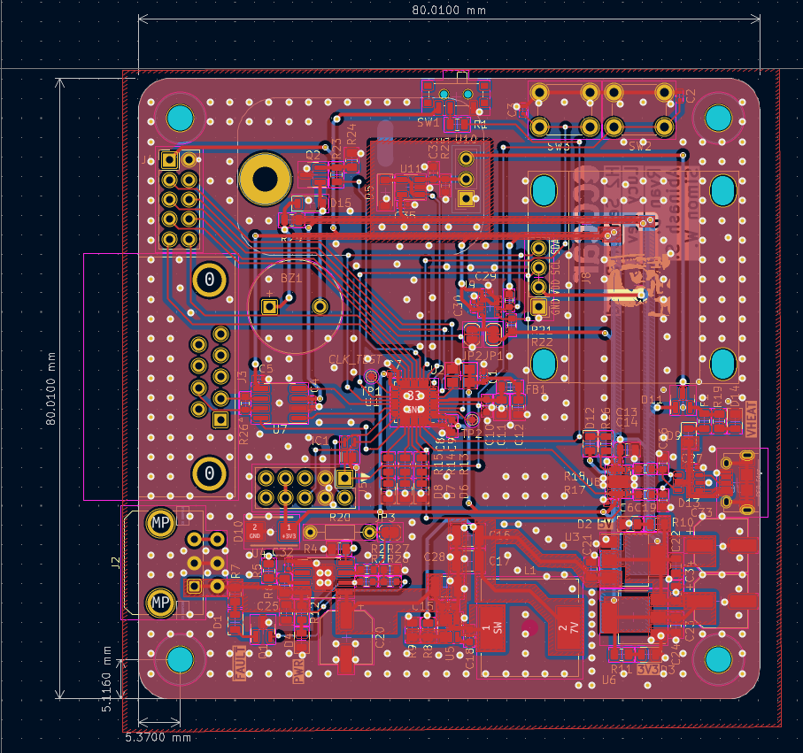
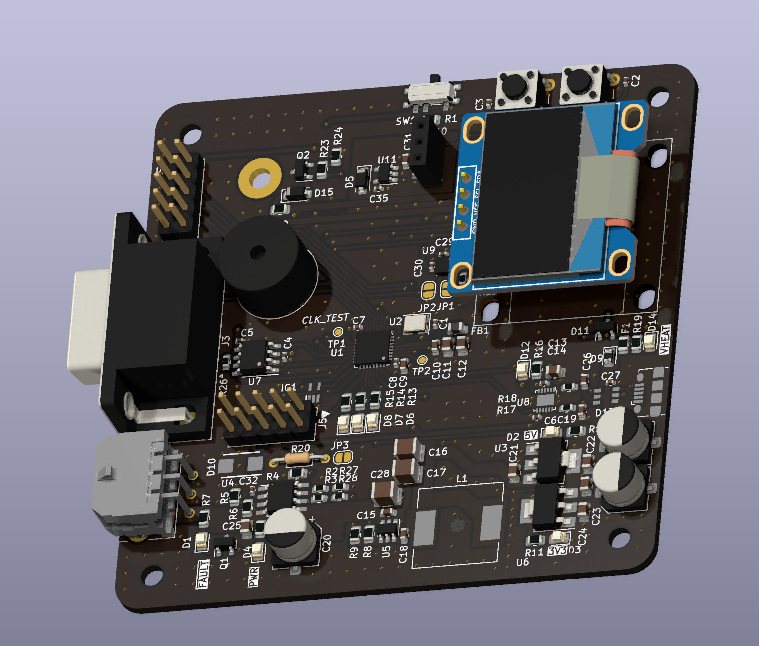
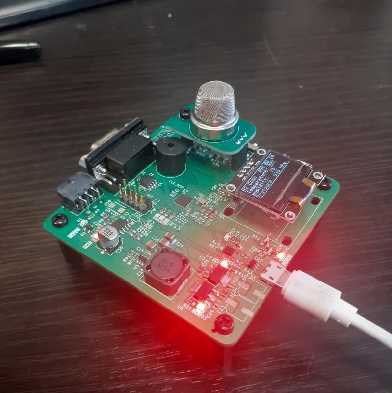

# H2 Sensor Board

## Current revision: Rev 2.1

### Credits: Ryan D., Simon W., Nick S., Abinash S., et al.

---

---

### Overview

The purpose of this board is to shut the system down if a certain preprogrammed concentration of H2 in the atmosphere.

It is a modular board, which uses a MQ-8 Winsen sensor on a detachable module thats held on a loft board.

We also included a OLED ssd1306 modular screen to display the measuremnts made by the sensor to debug and to enable live monitoring withough serial.

It is CAN Enabled on CAN 2.0B and runs at 1Mbps. It can send out a broadcast message which can be used by the fuelcell controller and shut the car down immidiatly.

---

### Field performance review

This board performed exceptionally well. It was able to pass techincal inspection and was able to shut the car down imeadiatly. The technicians blasted it with hydrogen and the sensor saturated immeadiatly (which is expeceted) and shut the car down with minimal delay (instantaniously; un-noticable to us).

### Board rundown

- Uses a MQ-8 Winsen hydrogen sensor.
- AP62250 Diodes buck.
- Uses 12V from fuel cell 
- Converts 12V to 5V 3V3
- Uses a STM32L432KCU6
- Also has a BME280 atmosphere humidity pressure and temprature sensor.
- Uses a I2C OLED screen to display data and current system state
- Uses 3 distinct RYG Leds to display system state.

---

### Firmware

I used FreeRTOS and STM32 HAL to program this board.

---

### Completed aspects

- Hydrogen is detected from the sensor and a proportional voltage is outputed on the ADC reading.
- The OLED screen worked really well with the multithreadin (I used mutexes because the BME280 was also a I2C device).
- The BME280 was well calibrated and worked perfectly.
- We were able to transmit on CAN and shut the car down when needed.

---

### Incomplete aspects

- Beeper was not working due to the mosfet not switching fast enough to enable the 5V beeper from the STM MCU
- We did not calibrate the H2 sensor to output ppm using the humidity and temprature based graphs. I also think I did not compensate for the voltage divider.
- I wanted to send all the measurements on the bus and was not able to implement and test in time.

### Power Tree

The power is taken from the 12V line then goes through a EFuse for Reverse voltage and current limiting, OVP, UVP. Then goes into a Buck to step down to 7V and then to a 5V Linear LDO regulator. Then the 5V goes to 3V3.